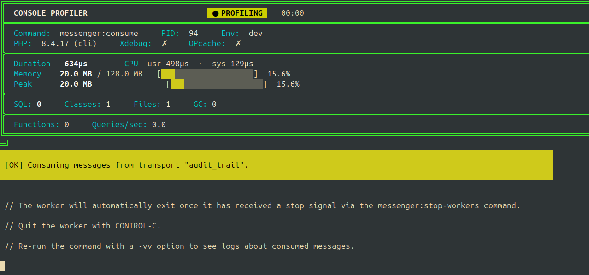

# Console Profiler Bundle

If you've ever watched a long-running Symfony console command crawl and
wondered, "Is this thing leaking memory? Am I hammering the database with N+1
queries right now?" — this bundle is for you.

The standard Symfony Profiler is amazing for HTTP requests, but it doesn't help
you much when a queue worker is eating up RAM in the background. The Console
Profiler Bundle hooks right into your terminal to give you a live, self-updating
dashboard while your commands are actually running.

It doesn't bloat your production environment, and the UI won't break your
standard output logs.



---

## Why use this over the Web Profiler?

The web profiler gives you a detailed snapshot after a request finishes. This
bundle is built for **real-time CLI visibility**.

Here are a few things it can do that the standard profiler can't:

1. **Catch memory leaks before the OOM crash:** We track your *Live Memory
   Growth Rate* (in bytes/sec). If your Messenger worker is leaking memory, the
   growth rate turns red so you can kill and debug it before the container dies.
2. **Profile CI pipeline performance:** You can configure the bundle to dump a
   JSON profile snapshot when a command finishes. You can parse this in your CI
   (like GitHub Actions) to fail a build if someone introduces a massive N+1
   query regression.
3. **Capture exit codes cleanly:** When you string commands together in bash,
   it's easy to lose track of what failed. The profiler freezes on completion
   and stamps the final exit code right at the top.

## Installation

Pop it into your dev dependencies via Composer:

```bash
composer require --dev rcsofttech/console-profiler-bundle
```

*Note: You'll need PHP 8.4+, Symfony 8.0+, and the `ext-pcntl` extension
(which you probably already have on Mac/Linux) to get the smooth async UI
updates.*

---

## Configuration (Optional)

You don't have to configure anything, it works right out of the box. But if you
want to tweak things, create `config/packages/console_profiler.yaml`:

```yaml
console_profiler:
    # Disable the profiler entirely if you want
    enabled: true

    # It's smart enough to turn itself off when kernel.debug is false
    exclude_in_prod: true

    # How often the TUI updates (in seconds)
    refresh_interval: 1

    # Don't bother profiling these noisy default commands
    excluded_commands:
        - 'list'
        - 'help'
        - 'completion'
        - '_complete'
        - 'cache:clear'
        - 'cache:warmup'

    # Set this to a path to save a JSON dump for CI regression testing
    profile_dump_path: '%kernel.project_dir%/var/log/profiler/last_run.json'
```

---

## Practical Examples

### 1. Debugging a leaky queue worker

Run your worker normally:

```bash
bin/console messenger:consume async
```

Look at the **Memory** row in the profiler. You'll see a `+X MB/s` indicator
showing exactly how fast memory is growing. If it holds steady into the yellow
or red, you know you've got a leak to fix.

### 2. Guarding against N+1 queries in CI

Set your `profile_dump_path` in `console_profiler.yaml`. Then, in your CI run:

```bash
# Run your heavy sync command
bin/console app:nightly-sync

# Check if someone blew up the query count using jq
SQL_COUNT=$(jq '.counters.sql_queries' var/log/profiler/last_run.json)

if [ "$SQL_COUNT" -gt 500 ]; then
  echo "Whoops! Regression: SQL queries exceeded 500 (got $SQL_COUNT)"
  exit 1
fi
```

The JSON dump tracks memory, CPU times, SQL counts, and more.

---

## How it works under the hood

We wanted this to be fast and safe, so we leaned on modern PHP features:

* **PHP 8.4 Property Hooks:** We use hooks to pull live memory directly via
  `memory_get_usage()` instead of caching stale data.
* **Ext-PCNTL:** We use async signals (`SIGALRM`) to safely redraw the dashboard
  once a second without freezing or interrupting your actual command logic.
* **Doctrine Middleware:** We wrap Doctrine DBAL 4 connections natively, meaning
  you don't have to change your repository code to count queries accurately.

## License

MIT License.
